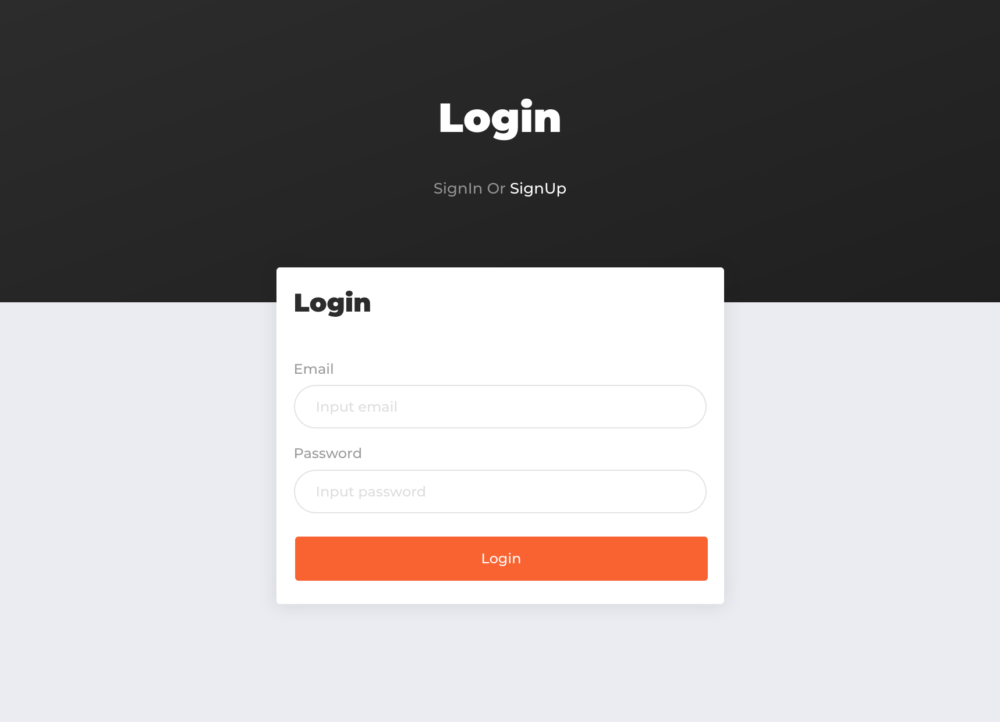
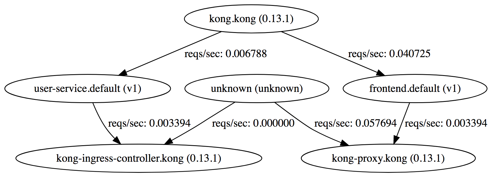
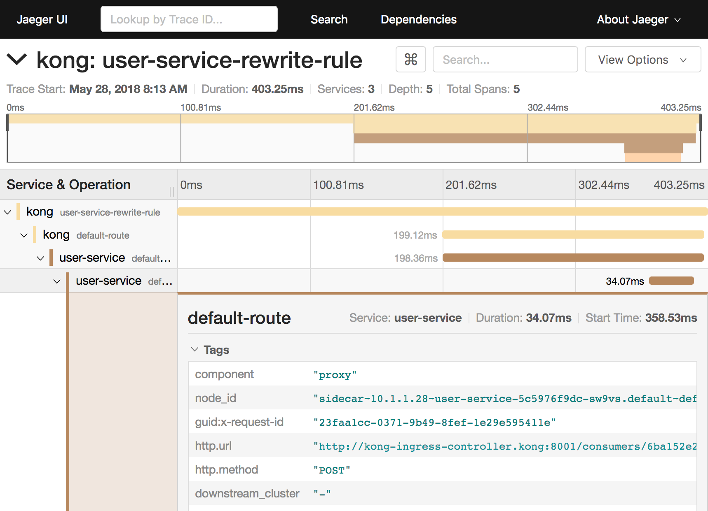
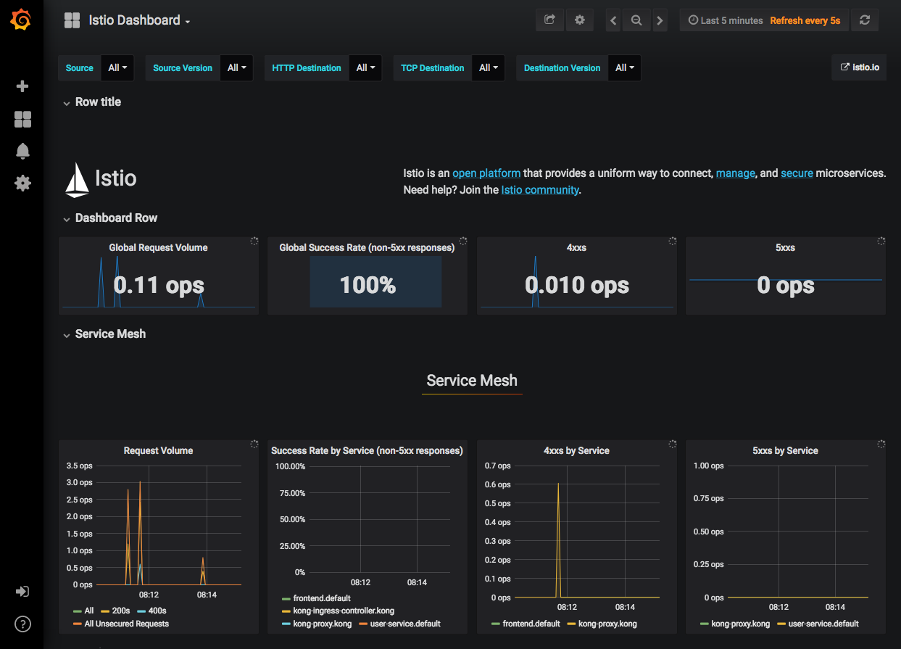

# k8s-study install

kubernetes x microservices sample project 설치 / 테스트 가이드

- [Prerequisites](#prerequisites)
- [Setup](#setup)
  - [Istio (Service Mesh)](#istio)
  - [Istio addons (zipkin or jaeger, prometheus, grafana, service graph)](#istio-addons)
  - [Kong (API Gateway)](#kong)
  - [Kong Plugin](#kong-plugin)
  - [Frontend (react/next.js)](#frontend)
  - [User Service (golang/gin)](#user-service)
- [Screenshot](#screenshot)
- [Known Issue](#known-issue)

## Prerequisites

- Kubernetes 1.9 이상
- Docker for mac(18.05.0-ce edge)에서 테스트하였음

### /etc/hosts

```
127.0.0.1 pongpong.io www.pongpong.io api.pongpong.io
```

## Setup

### Istio

- Istio client를 설치함 (0.8.0 이상)

```
# move to temp directory
cd ~/Downloads
curl -L https://git.io/getLatestIstio | sh -
export ISTIO_VESRION=0.8.0
mv istio-${ISTIO_VESRION}/bin/istioctl /usr/local/bin
# test
istioctl version
# cleanup
rm -rf istio-${ISTIO_VESRION}
```

- Istio를 설치함 (mixer, pilot, citadel, ...)
- Tracing, Prometheus, Grafana, Servicegraph 설치
- Kong Ingress를 사용할 것이므로 istio ingress controller는 제외함
- mTLS도 사용하지 않음
- `no matches for config.istio.io` 에러 발생시 한번더 `apply`

```
kubectl apply -f install/istio.yaml
# check
kubectl -n istio-system get svc
kubectl -n istio-system get po
```

### Istio Automatic sidecar injection

```
kubectl label namespace default istio-injection=enabled
kubectl get namespace -L istio-injection
```

### Istio addons port forwarding

- Tracing, Prometheus, Grafana, Servicegraph

```
kubectl port-forward -n istio-system $(kubectl get pod -n istio-system -l app=jaeger -o jsonpath='{.items[0].metadata.name}') 16686:16686 & # jaeger
kubectl -n istio-system port-forward $(kubectl -n istio-system get pod -l app=prometheus -o jsonpath='{.items[0].metadata.name}') 9090:9090 & # prometheus
kubectl -n istio-system port-forward $(kubectl -n istio-system get pod -l app=grafana -o jsonpath='{.items[0].metadata.name}') 3000:3000 & # grafana
kubectl -n istio-system port-forward $(kubectl -n istio-system get pod -l app=servicegraph -o jsonpath='{.items[0].metadata.name}') 8088:8088 & # service graph
# test
open http://localhost:16686
open http://localhost:9090
open http://localhost:3000
open http://localhost:8088/dotviz
```

- prometheus test

expression sample

```
istio_request_count
istio_request_count{response_code="200"}
```

### Istio Default Config

내부에서 `kong-proxy.kong.svc.cluster.local` 연결시 Host header를 `api.pongpong.io`로 rewrite함

```
kubectl apply -f service/default/istio-route.yaml
istioctl get virtualservice
istioctl get virtualservice internal-kong-proxy -o yaml
```

### Kong

- kong + kong ingress 설치

설치하는데 시간이 조금 걸리고 에러가 발생하지만 조금 기다려야함

```
istioctl kube-inject -f install/kong-all-in-one-postgres.yaml | kubectl apply -f -
# check
kubectl -n kong get svc
watch kubectl -n kong get po
```

### Kong Plugin

- key auth 활성화

현재 버전(0.0.3)에서는 재설치시 오류발생

```
kubectl apply -f service/default/kong-plugins.yaml
# check
kubectl proxy
curl http://localhost:8001/api/v1/namespaces/kong/services/http:kong-ingress-controller:8001/proxy/consumers
curl http://localhost:8001/api/v1/namespaces/kong/services/http:kong-ingress-controller:8001/proxy/key-auths
```

### Frontend

```
kubectl apply -f service/frontend
# check
kubectl get svc
kubectl get po
# test
open http://www.pongpong.io
```

### User Service

```
kubectl apply -f service/user-service
# check
kubectl get svc
kubectl get po
# test
kubectl proxy
curl http://localhost:8001/api/v1/namespaces/kong/services/http:kong-ingress-controller:8001/proxy/services
curl http://localhost:8001/api/v1/namespaces/kong/services/http:kong-ingress-controller:8001/proxy/routes
curl http://localhost:8001/api/v1/namespaces/kong/services/http:kong-ingress-controller:8001/proxy/plugins
```

## Screenshot

- frontend



- dotviz



- jaeger



- grafana



## Known Issue

### Kong Ingress

kong ingress가 아직 초창기 버전이라 기능이 부족하고 버그가 있음.

- 공식 이미지 대신 subicura/kong-ingress-controller-amd64 사용
- plugin을 사용하는 서비스를 삭제(delete)하면 plugin도 삭제됨. 다시 만들어야함
